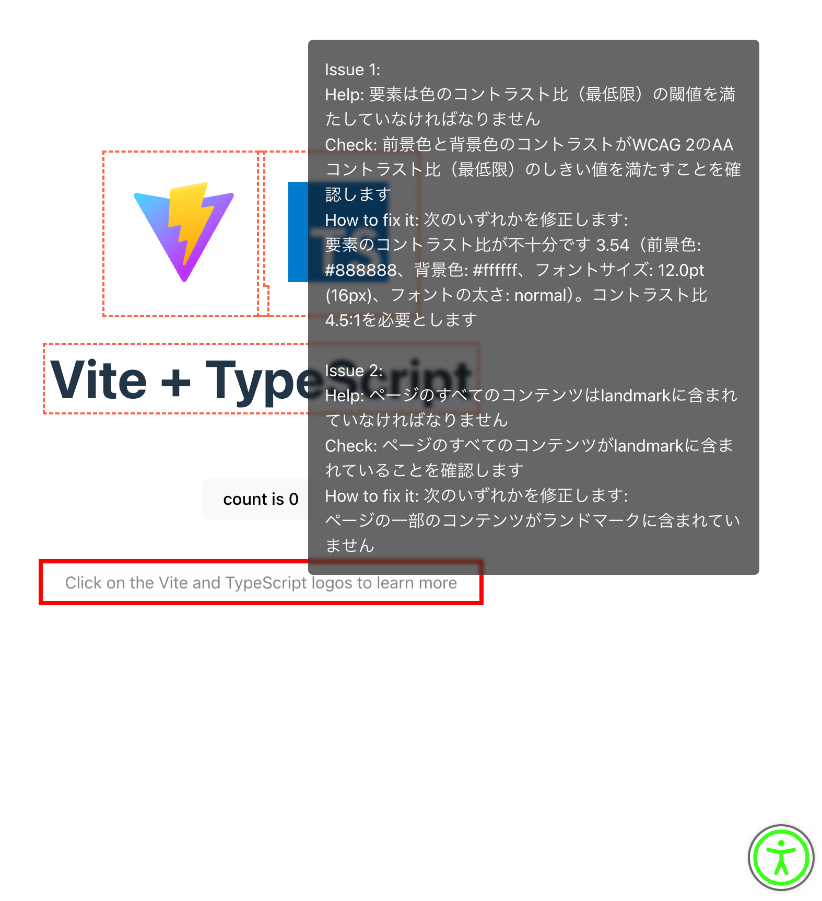

# Vite Axe Plugin



This Vite plugin inserts the Axe accessibility testing script into your HTML files, configured for a specified locale.

When the plugin detects an issue with `axe-core`, an accessibility check button will appear at the bottom right of the screen. Clicking the check button will highlight the affected elements with a dashed outline. Hovering over these elements will display a tooltip explaining the issue.

## Installation

First, install the necessary devDependencies:

```bash
npm install axe-core vite-plugin-insert-axe --save-dev
```

## Configuration

Create a `vite.config.ts` file and configure the plugin:

```typescript
// vite.config.ts

import { defineConfig } from "vite";
import { InsertScriptPlugin } from "./plugins/InsertScriptPlugin";
export default defineConfig({
  plugins: [InsertScriptPlugin('ja')], // Specify the locale here
});
```

## Supported Locales

The following locales are supported:

- "en" (English)
- "da" (Danish)
- "de" (German)
- "el" (Greek)
- "es" (Spanish)
- "eu" (Basque)
- "fr" (French)
- "he" (Hebrew)
- "it" (Italian)
- "ja" (Japanese)
- "ko" (Korean)
- "nl" (Dutch)
- "no_NB" (Norwegian Bokmål)
- "pl" (Polish)
- "pt_BR" (Portuguese, Brazil)
- "zh_CN" (Chinese, Simplified)
- "zh_TW" (Chinese, Traditional)

## License

MIT

